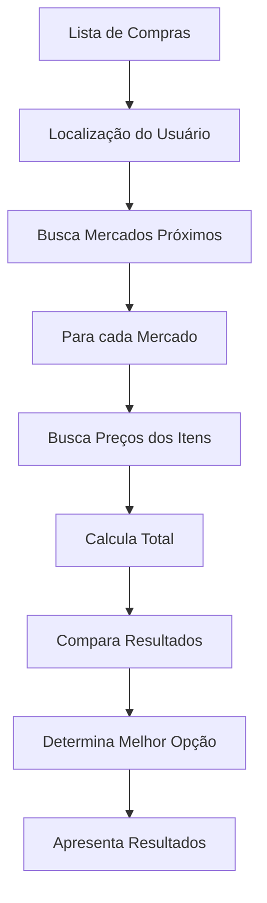

# 🏪 Comparação Inteligente de Preços - Documentação Técnica

## 📋 **Visão Geral**

Este documento detalha a implementação da funcionalidade de **Comparação Inteligente de Preços** do Economiza AI, que analisa automaticamente os 4 supermercados mais próximos e calcula a economia total para a lista de compras do usuário.

---

## 🎯 **Objetivos da Funcionalidade**

### **Primários**

- Identificar os 4 supermercados mais próximos da localização do usuário
- Calcular o custo total da lista de compras em cada mercado
- Determinar qual mercado oferece a maior economia
- Apresentar os resultados de forma clara e visual

### **Secundários**

- Manter histórico de comparações para análise temporal
- Alertar sobre variações significativas de preços
- Sugerir estratégias de economia baseadas em padrões
- Integrar com APIs de preços em tempo real
- **Salvar automaticamente** todas as comparações no histórico
- **Gerar relatórios** de economia ao longo do tempo

---

## 🏗️ **Arquitetura da Solução**

### **Fluxo de Dados**



### **Componentes Principais**

1. **PriceComparisonService** - Serviço principal de comparação
2. **NearbyStoresFinder** - Busca mercados próximos
3. **PriceCalculator** - Calcula totais por mercado
4. **ComparisonUI** - Interface de apresentação
5. **ComparisonHistory** - Armazenamento de histórico

---

## 💾 **Estrutura de Dados**

### **Comparação de Preços**

```javascript
// Estrutura principal da comparação
interface PriceComparison {
  id: string;
  userId: string;
  timestamp: Date;
  userLocation: {
    lat: number,
    lng: number,
  };
  shoppingList: ShoppingItem[];
  comparisons: StoreComparison[];
  bestOption: {
    storeId: string,
    totalPrice: number,
    savings: number,
    percentageSavings: number,
  };
  metadata: {
    totalItems: number,
    totalStores: number,
    calculationTime: number,
  };
}

// Comparação por mercado
interface StoreComparison {
  store: {
    id: string,
    name: string,
    address: string,
    coords: { lat: number, lng: number },
    distance: number; // km
    logoUrl?: string,
  };
  totalPrice: number;
  itemPrices: ItemPrice[];
  savings?: number;
  percentageSavings?: number;
}

// Preço por item
interface ItemPrice {
  itemName: string;
  quantity: number;
  unitPrice: number;
  totalPrice: number;
  lastUpdated: Date;
  priceSource: 'user' | 'api' | 'estimated';
}
```

### **Coleções Firestore**

```javascript
// Nova coleção para comparações
/comparisons/{comparisonId}/
├── userId: string
├── timestamp: timestamp
├── userLocation: geopoint
├── shoppingList: array
├── comparisons: array
├── bestOption: object
└── metadata: object

// Atualização da coleção de preços
/prices/{itemName}/stores/{storeId}/
├── latestPrice: number
├── lastUpdated: timestamp
├── priceHistory: array
└── priceSource: string
```

---

## 🔧 **Implementação Técnica**

### **1. Serviço de Comparação**

```javascript
// src/services/PriceComparisonService.js
class PriceComparisonService {
  constructor() {
    this.nearbyStoresFinder = new NearbyStoresFinder();
    this.priceCalculator = new PriceCalculator();
  }

  async comparePrices(shoppingList, userLocation) {
    try {
      // 1. Buscar mercados próximos
      const nearbyStores = await this.nearbyStoresFinder.findNearbyStores(
        userLocation,
        4
      );

      // 2. Calcular preços para cada mercado
      const comparisons = await Promise.all(
        nearbyStores.map(store =>
          this.priceCalculator.calculateStoreTotal(shoppingList, store)
        )
      );

      // 3. Determinar melhor opção
      const bestOption = this.findBestOption(comparisons);

      // 4. Calcular economias
      const comparisonsWithSavings = this.calculateSavings(
        comparisons,
        bestOption
      );

      // 5. Criar objeto de comparação
      const comparison = {
        id: generateId(),
        userId: getCurrentUserId(),
        timestamp: new Date(),
        userLocation,
        shoppingList,
        comparisons: comparisonsWithSavings,
        bestOption,
        metadata: {
          totalItems: shoppingList.length,
          totalStores: nearbyStores.length,
          calculationTime: Date.now(),
        },
      };

      // 6. Salvar no Firestore
      await this.saveComparison(comparison);

      return comparison;
    } catch (error) {
      console.error('Erro na comparação de preços:', error);
      throw error;
    }
  }

  findBestOption(comparisons) {
    return comparisons.reduce((best, current) =>
      current.totalPrice < best.totalPrice ? current : best
    );
  }

  calculateSavings(comparisons, bestOption) {
    const maxPrice = Math.max(...comparisons.map(c => c.totalPrice));

    return comparisons.map(comparison => ({
      ...comparison,
      savings: maxPrice - comparison.totalPrice,
      percentageSavings: ((maxPrice - comparison.totalPrice) / maxPrice) * 100,
    }));
  }
}
```

### **2. Buscador de Mercados Próximos**

```javascript
// src/services/NearbyStoresFinder.js
class NearbyStoresFinder {
  async findNearbyStores(userLocation, limit = 4) {
    try {
      // 1. Buscar mercados via OpenStreetMap
      const stores = await this.searchOpenStreetMap(userLocation);

      // 2. Calcular distâncias
      const storesWithDistance = stores.map(store => ({
        ...store,
        distance: this.calculateDistance(userLocation, store.coords),
      }));

      // 3. Ordenar por distância e limitar
      return storesWithDistance
        .sort((a, b) => a.distance - b.distance)
        .slice(0, limit);
    } catch (error) {
      console.error('Erro ao buscar mercados próximos:', error);
      throw error;
    }
  }

  calculateDistance(point1, point2) {
    const R = 6371; // Raio da Terra em km
    const dLat = this.deg2rad(point2.lat - point1.lat);
    const dLon = this.deg2rad(point2.lng - point1.lng);

    const a =
      Math.sin(dLat / 2) * Math.sin(dLat / 2) +
      Math.cos(this.deg2rad(point1.lat)) *
        Math.cos(this.deg2rad(point2.lat)) *
        Math.sin(dLon / 2) *
        Math.sin(dLon / 2);

    const c = 2 * Math.atan2(Math.sqrt(a), Math.sqrt(1 - a));
    return R * c; // Distância em km
  }

  deg2rad(deg) {
    return deg * (Math.PI / 180);
  }
}
```

### **3. Calculador de Preços**

```javascript
// src/services/PriceCalculator.js
class PriceCalculator {
  async calculateStoreTotal(shoppingList, store) {
    try {
      const itemPrices = await Promise.all(
        shoppingList.map(item => this.getItemPrice(item, store.id))
      );

      const totalPrice = itemPrices.reduce(
        (sum, item) => sum + item.totalPrice,
        0
      );

      return {
        store,
        totalPrice,
        itemPrices,
      };
    } catch (error) {
      console.error('Erro ao calcular preços:', error);
      throw error;
    }
  }

  async getItemPrice(item, storeId) {
    try {
      // 1. Tentar buscar preço mais recente no Firestore
      const latestPrice = await this.getLatestPrice(item.name, storeId);

      if (latestPrice) {
        return {
          itemName: item.name,
          quantity: item.quantity,
          unitPrice: latestPrice,
          totalPrice: latestPrice * item.quantity,
          lastUpdated: new Date(),
          priceSource: 'user',
        };
      }

      // 2. Se não encontrar, usar preço estimado
      const estimatedPrice = await this.getEstimatedPrice(item.name);

      return {
        itemName: item.name,
        quantity: item.quantity,
        unitPrice: estimatedPrice,
        totalPrice: estimatedPrice * item.quantity,
        lastUpdated: new Date(),
        priceSource: 'estimated',
      };
    } catch (error) {
      console.error('Erro ao buscar preço:', error);
      throw error;
    }
  }
}
```

---

## 🎨 **Interface do Usuário**

### **Componente Principal**

```javascript
// src/components/PriceComparison/PriceComparison.js
import React, { useState, useEffect } from 'react';
import { Card, Typography, Button, CircularProgress } from '@mui/material';
import { PriceComparisonService } from '../../services/PriceComparisonService';

const PriceComparison = ({ shoppingList, userLocation }) => {
  const [comparison, setComparison] = useState(null);
  const [loading, setLoading] = useState(false);
  const [error, setError] = useState(null);

  const priceComparisonService = new PriceComparisonService();

  const handleCompare = async () => {
    setLoading(true);
    setError(null);

    try {
      const result = await priceComparisonService.comparePrices(
        shoppingList,
        userLocation
      );
      setComparison(result);
    } catch (err) {
      setError('Erro ao comparar preços. Tente novamente.');
    } finally {
      setLoading(false);
    }
  };

  return (
    <div className='price-comparison'>
      <Typography variant='h5' gutterBottom>
        Comparação de Preços
      </Typography>

      {!comparison && (
        <Button
          variant='contained'
          onClick={handleCompare}
          disabled={loading}
          startIcon={loading ? <CircularProgress size={20} /> : null}
        >
          {loading ? 'Comparando...' : 'Comparar Preços'}
        </Button>
      )}

      {error && (
        <Typography color='error' variant='body2'>
          {error}
        </Typography>
      )}

      {comparison && <ComparisonResults comparison={comparison} />}
    </div>
  );
};
```

### **Componente de Resultados**

```javascript
// src/components/PriceComparison/ComparisonResults.js
const ComparisonResults = ({ comparison }) => {
  const { comparisons, bestOption } = comparison;

  return (
    <div className="comparison-results">
      <Typography variant="h6" gutterBottom>
        Resultados da Comparação
      </Typography>

      <div className="stores-grid">
        {comparisons.map((storeComparison, index) => (
          <StoreComparisonCard
            key={storeComparison.store.id}
            comparison={storeComparison}
            isBest={storeComparison.store.id === bestOption.storeId}
            rank={index + 1}
          />
        ))}
      </div>

      <BestOptionSummary bestOption={bestOption} />
    </div>
  );
};
```

---

## 📊 **Histórico de Comparações**

### **Funcionalidade de Histórico**

O sistema **salva automaticamente** todas as comparações realizadas pelo usuário, permitindo:

- **Análise temporal** de economia ao longo do tempo
- **Tendências de preços** por mercado e item
- **Relatórios de economia** mensal e anual
- **Comparação com compras anteriores** para acompanhar progresso
- **Alertas de variação** significativa de preços

### **Estrutura do Histórico**

```javascript
// Estrutura do histórico de comparações
interface ComparisonHistory {
  id: string;
  userId: string;
  timestamp: Date;
  userLocation: {
    lat: number;
    lng: number;
  };
  shoppingList: ShoppingItem[];
  comparisons: StoreComparison[];
  bestOption: {
    storeId: string;
    totalPrice: number;
    savings: number;
    percentageSavings: number;
  };
  metadata: {
    totalItems: number;
    totalStores: number;
    calculationTime: number;
    comparisonType: 'manual' | 'automatic';
  };
  analytics: {
    totalSavings: number;
    averageSavings: number;
    trendDirection: 'improving' | 'declining' | 'stable';
    priceVolatility: number;
  };
}
```

### **Serviço de Histórico**

```javascript
// src/services/ComparisonHistoryService.js
class ComparisonHistoryService {
  constructor() {
    this.db = getFirestore();
  }

  async saveComparison(comparison) {
    try {
      const comparisonRef = doc(collection(this.db, 'comparisons'));
      const comparisonData = {
        ...comparison,
        id: comparisonRef.id,
        timestamp: serverTimestamp(),
        analytics: await this.calculateAnalytics(comparison)
      };

      await setDoc(comparisonRef, comparisonData);
      console.log('Comparação salva no histórico:', comparisonRef.id);

      return comparisonRef.id;
    } catch (error) {
      console.error('Erro ao salvar comparação:', error);
      throw error;
    }
  }

  async getUserHistory(userId, limit = 50) {
    try {
      const q = query(
        collection(this.db, 'comparisons'),
        where('userId', '==', userId),
        orderBy('timestamp', 'desc'),
        limit(limit)
      );

      const querySnapshot = await getDocs(q);
      return querySnapshot.docs.map(doc => ({
        id: doc.id,
        ...doc.data()
      }));
    } catch (error) {
      console.error('Erro ao buscar histórico:', error);
      throw error;
    }
  }

  async getEconomyReport(userId, period = 'month') {
    try {
      const startDate = this.getStartDate(period);
      const history = await this.getUserHistory(userId, 100);

      const filteredHistory = history.filter(
        comparison => comparison.timestamp.toDate() >= startDate
      );

      return {
        totalComparisons: filteredHistory.length,
        totalSavings: filteredHistory.reduce((sum, comp) => sum + comp.bestOption.savings, 0),
        averageSavings: filteredHistory.reduce((sum, comp) => sum + comp.bestOption.savings, 0) / filteredHistory.length,
        bestMonth: this.findBestMonth(filteredHistory),
        trendAnalysis: this.analyzeTrend(filteredHistory),
        topStores: this.getTopStores(filteredHistory)
      };
    } catch (error) {
      console.error('Erro ao gerar relatório:', error);
      throw error;
    }
  }

  async calculateAnalytics(comparison) {
    const { comparisons, bestOption } = comparison;
    const maxPrice = Math.max(...comparisons.map(c => c.totalPrice));

    return {
      totalSavings: bestOption.savings,
      averageSavings: bestOption.savings / comparisons.length,
      trendDirection: await this.getTrendDirection(comparison),
      priceVolatility: this.calculateVolatility(comparisons)
    };
  }

  getTrendDirection(comparison) {
    // Compara com histórico anterior para determinar tendência
    // Retorna 'improving', 'declining' ou 'stable'
  }

  calculateVolatility(comparisons) {
    const prices = comparisons.map(c => c.totalPrice);
    const mean = prices.reduce((sum, price) => sum + price, 0) / prices.length;
    const variance = prices.reduce((sum, price) => sum + Math.pow(price - mean, 2), 0) / prices.length;
    return Math.sqrt(variance);
  }
}
```

### **Componente de Histórico**

```javascript
// src/components/ComparisonHistory/ComparisonHistory.js
const ComparisonHistory = ({ userId }) => {
  const [history, setHistory] = useState([]);
  const [report, setReport] = useState(null);
  const [loading, setLoading] = useState(false);

  const historyService = new ComparisonHistoryService();

  useEffect(() => {
    loadHistory();
    loadReport();
  }, [userId]);

  const loadHistory = async () => {
    setLoading(true);
    try {
      const userHistory = await historyService.getUserHistory(userId);
      setHistory(userHistory);
    } catch (error) {
      console.error('Erro ao carregar histórico:', error);
    } finally {
      setLoading(false);
    }
  };

  const loadReport = async () => {
    try {
      const economyReport = await historyService.getEconomyReport(userId);
      setReport(economyReport);
    } catch (error) {
      console.error('Erro ao carregar relatório:', error);
    }
  };

  return (
    <div className="comparison-history">
      <Typography variant="h5" gutterBottom>
        Histórico de Comparações
      </Typography>

      {report && (
        <EconomyReportCard report={report} />
      )}

      <div className="history-list">
        {history.map((comparison) => (
          <ComparisonHistoryCard
            key={comparison.id}
            comparison={comparison}
          />
        ))}
      </div>
    </div>
  );
};
```

### **Relatórios de Economia**

```javascript
// src/components/ComparisonHistory/EconomyReportCard.js
const EconomyReportCard = ({ report }) => {
  return (
    <Card className="economy-report-card">
      <CardContent>
        <Typography variant="h6" gutterBottom>
          📊 Relatório de Economia
        </Typography>

        <Grid container spacing={2}>
          <Grid item xs={6}>
            <Typography variant="body2" color="textSecondary">
              Total de Comparações
            </Typography>
            <Typography variant="h4">
              {report.totalComparisons}
            </Typography>
          </Grid>

          <Grid item xs={6}>
            <Typography variant="body2" color="textSecondary">
              Economia Total
            </Typography>
            <Typography variant="h4" color="success.main">
              R$ {report.totalSavings.toFixed(2)}
            </Typography>
          </Grid>

          <Grid item xs={6}>
            <Typography variant="body2" color="textSecondary">
              Economia Média
            </Typography>
            <Typography variant="h6">
              R$ {report.averageSavings.toFixed(2)}
            </Typography>
          </Grid>

          <Grid item xs={6}>
            <Typography variant="body2" color="textSecondary">
              Tendência
            </Typography>
            <Typography variant="h6" color={
              report.trendAnalysis.direction === 'improving' ? 'success.main' :
              report.trendAnalysis.direction === 'declining' ? 'error.main' : 'textPrimary'
            }>
              {report.trendAnalysis.direction === 'improving' ? '📈 Melhorando' :
               report.trendAnalysis.direction === 'declining' ? '📉 Declinando' : '➡️ Estável'}
            </Typography>
          </Grid>
        </Grid>
      </CardContent>
    </Card>
  );
};
```

---

## 📊 **Exemplos de Uso**

### **Exemplo 1: Lista Básica**

```javascript
// Lista de compras do usuário
const shoppingList = [
  { name: 'Arroz 5kg', quantity: 2 },
  { name: 'Feijão 1kg', quantity: 3 },
  { name: 'Óleo de Soja 900ml', quantity: 2 },
  { name: 'Macarrão 500g', quantity: 4 },
  { name: 'Leite 1L', quantity: 6 },
];

// Localização do usuário
const userLocation = {
  lat: -23.5505,
  lng: -46.6333,
};

// Executar comparação
const comparison = await priceComparisonService.comparePrices(
  shoppingList,
  userLocation
);

console.log('Melhor opção:', comparison.bestOption);
// Resultado: { storeId: "store_2", totalPrice: 74.00, savings: 9.50 }
```

### **Exemplo 2: Lista com Produtos Específicos**

```javascript
const shoppingList = [
  { name: 'Carne Bovina 1kg', quantity: 2 },
  { name: 'Frango 1kg', quantity: 1 },
  { name: 'Batata 1kg', quantity: 3 },
  { name: 'Cebola 1kg', quantity: 2 },
  { name: 'Tomate 1kg', quantity: 2 },
  { name: 'Banana 1kg', quantity: 4 },
];

const comparison = await priceComparisonService.comparePrices(
  shoppingList,
  userLocation
);

// Análise dos resultados
comparison.comparisons.forEach(store => {
  console.log(`${store.store.name}: R$ ${store.totalPrice.toFixed(2)}`);
  console.log(`Economia: R$ ${store.savings?.toFixed(2)}`);
});
```

---

## 🚀 **Roadmap de Implementação**

### **Fase 1: MVP (2-3 semanas)**
- [x] Estrutura de dados no Firestore
- [x] Serviço básico de comparação
- [x] Interface simples de resultados
- [x] Integração com mercados existentes
- [ ] **Salvamento automático** de comparações no histórico

### **Fase 2: Melhorias (3-4 semanas)**
- [ ] Interface avançada com gráficos
- [ ] **Histórico de comparações** com visualização
- [ ] **Relatórios de economia** mensal e anual
- [ ] Alertas de variação de preços
- [ ] Cache inteligente de preços

### **Fase 3: Recursos Avançados (4-6 semanas)**
- [ ] Integração com APIs de preços
- [ ] **Análise temporal** de tendências
- [ ] **Comparação com histórico** anterior
- [ ] Machine Learning para previsões
- [ ] Notificações push
- [ ] Relatórios de economia

### **Fase 4: Otimizações (2-3 semanas)**
- [ ] Performance optimization
- [ ] A/B testing
- [ ] Analytics avançados
- [ ] Integração com cupons
- [ ] **Exportação de relatórios** em PDF/Excel

---

## 🧪 **Testes**

### **Testes Unitários**

```javascript
// src/services/__tests__/PriceComparisonService.test.js
describe('PriceComparisonService', () => {
  test('should compare prices correctly', async () => {
    const service = new PriceComparisonService();
    const shoppingList = [{ name: 'Arroz 5kg', quantity: 1 }];
    const userLocation = { lat: -23.5505, lng: -46.6333 };

    const result = await service.comparePrices(shoppingList, userLocation);

    expect(result.comparisons).toHaveLength(4);
    expect(result.bestOption).toBeDefined();
    expect(result.bestOption.totalPrice).toBeLessThan(
      Math.max(...result.comparisons.map(c => c.totalPrice))
    );
  });
});
```

### **Testes de Integração**

```javascript
// src/integration/__tests__/priceComparison.integration.test.js
describe('Price Comparison Integration', () => {
  test('should work with real Firestore data', async () => {
    // Teste com dados reais do Firestore
  });

  test('should handle API rate limits', async () => {
    // Teste de limites de API
  });
});
```

---

## 📈 **Métricas e Analytics**

### **Métricas Principais**

- **Taxa de uso**: % de usuários que usam a comparação
- **Economia média**: Valor médio economizado por comparação
- **Tempo de cálculo**: Tempo médio para gerar comparação
- **Precisão**: % de preços corretos vs. estimados

### **KPIs de Sucesso**

- **Economia total**: R$ economizados pelos usuários
- **Engajamento**: Frequência de uso da funcionalidade
- **Satisfação**: Rating da funcionalidade
- **Retenção**: Usuários que retornam para usar

---

## 🔒 **Considerações de Segurança**

### **Validação de Dados**

- Validar localização do usuário
- Sanitizar dados de entrada
- Verificar permissões de acesso

### **Rate Limiting**

- Limitar comparações por usuário
- Implementar cache para evitar sobrecarga
- Monitorar uso de APIs externas

### **Privacidade**

- Anonimizar dados de comparação
- Permitir exclusão de histórico
- Cumprir LGPD/GDPR

---

## 📚 **Referências**

- [Firebase Firestore Documentation](https://firebase.google.com/docs/firestore)
- [OpenStreetMap Overpass API](https://wiki.openstreetmap.org/wiki/Overpass_API)
- [Material-UI Components](https://mui.com/components/)
- [React Hooks Documentation](https://reactjs.org/docs/hooks-intro.html)

---

_Última atualização: Dezembro 2024_
