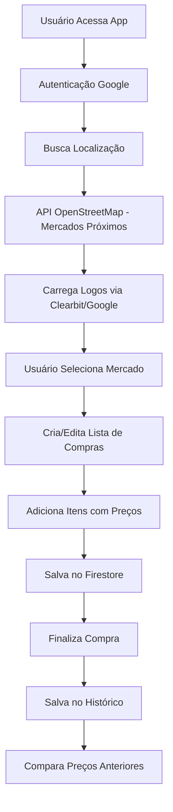

#  Economiza AI

**Economiza AI** é um aplicativo web moderno de lista de compras inteligente, desenvolvido em React com integração Firebase, focado em ajudar usuários a economizar através de comparação de preços, histórico de compras e gestão inteligente de mercados.

---

## 🎯 **Objetivo Real do Projeto**

O **Economiza AI** foi desenvolvido para transformar a experiência de compras em algo mais inteligente e econômico. O sistema permite:

- **Gestão de mercados próximos** com busca automática via OpenStreetMap
- **Listas de compras inteligentes** com persistência em Firebase
- **Histórico detalhado** de todas as compras realizadas
- **Sistema de preços** para comparação entre mercados
- **Interface responsiva** otimizada para mobile e desktop

---

## 🏗️ **Arquitetura Técnica Real**

### **Frontend**

- **React 18** - Framework principal com hooks modernos
- **CSS3** - Estilização com gradientes, glassmorphism e animações
- **Material-UI** - Componentes de interface (@mui/material, @mui/icons-material)
- **Fuse.js** - Busca fuzzy para sugestões inteligentes

### **Backend & Banco de Dados**

- **Firebase Firestore** - Banco de dados NoSQL em tempo real
- **Firebase Auth** - Autenticação com Google
- **Firebase Hosting** - Deploy e hospedagem

### **APIs Integradas**

- **OpenStreetMap Overpass API** - Busca de mercados próximos
- **Clearbit Logo API** - Logos automáticos de mercados
- **Google Images** - Fallback para logos (via proxy CORS)

### **Funcionalidades Avançadas**

- **Tesseract.js** - OCR para leitura de preços (em desenvolvimento)
- **ZXing Browser** - Leitor de código de barras (em desenvolvimento)
- **OpenAI API** - Sugestões inteligentes (configurado)

---

## 🔄 **Fluxo Real do Sistema**



---

## 📱 **Funcionalidades Implementadas**

### ✅ **Sistema de Mercados**

- **Busca automática** de mercados próximos via OpenStreetMap
- **Cálculo de distância** usando fórmula de Haversine
- **Logos automáticos** via Clearbit API + fallback Google Images
- **Mercados favoritos** com persistência no Firestore
- **Adição manual** de mercados personalizados
- **Agrupamento por distância** (até 1km, 1-2km, 2-5km, +5km)

### ✅ **Lista de Compras**

- **Interface intuitiva** com cards glassmorphism
- **Adição de itens** com nome, quantidade, valor unitário
- **Persistência automática** no Firestore
- **Sincronização** entre dispositivos
- **Barra de progresso** visual em tempo real

### ✅ **Sistema de Preços**

- **Registro de preços** por item/mercado
- **Histórico de preços** com timestamps
- **Comparação automática** com compras anteriores
- **Estrutura de dados** otimizada no Firestore

### ✅ **Histórico de Compras**

- **Visualização detalhada** de cada compra
- **Cálculo automático** de totais
- **Cards responsivos** com informações completas
- **Navegação intuitiva** entre histórico e detalhes

### ✅ **Autenticação & Usuários**

- **Login com Google** via Firebase Auth
- **Perfis de usuário** com dados persistentes
- **Sistema de permissões** (USER, STORE_MANAGER, ADMIN)
- **Gestão de usuários** para administradores

### ✅ **Interface & UX**

- **Design responsivo** para mobile, tablet e desktop
- **Modo escuro/claro** com persistência
- **Animações suaves** e transições
- **Acessibilidade** com navegação por teclado
- **Loading states** e feedback visual

---

## 🗄️ **Estrutura do Banco de Dados (Firestore)**

### **Coleções Principais**

```
/users/{userId}/
├── favorites/stores - Lojas favoritas
├── shoppingLists/{storeId} - Listas de compras
├── location - Localização do usuário
└── profile - Dados do perfil

/prices/{itemName}/stores/{storeName}/
├── latestPrice - Preço mais recente
└── history/ - Histórico de preços

/stores/{storeId}/
├── name, address, coords
├── logoUrl, website
└── managers - Gerentes da loja
```

---

## 🛠️ **Tecnologias Detalhadas**

| Tecnologia        | Versão  | Uso                    |
| ----------------- | ------- | ---------------------- |
| **React**         | 18.2.0  | Framework principal    |
| **Firebase**      | 11.9.1  | Backend completo       |
| **Material-UI**   | 5.15.10 | Componentes UI         |
| **Fuse.js**       | 7.0.0   | Busca fuzzy            |
| **Tesseract.js**  | 6.0.1   | OCR (dev)              |
| **ZXing Browser** | 0.1.5   | Código de barras (dev) |
| **OpenAI**        | 5.6.0   | Sugestões IA           |

---

## 🚀 **Como Executar o Projeto**

### **Pré-requisitos**

- Node.js >= 16.0.0
- npm >= 8.0.0
- Conta Firebase

### **Instalação**

```bash
# Clone o repositório
git clone https://github.com/leodigory/Economiza-ai.git
cd Economiza-ai

# Instale as dependências
npm install

# Configure as variáveis de ambiente
cp .env.example .env
# Edite .env com suas credenciais Firebase
```

### **Variáveis de Ambiente Necessárias**

```env
REACT_APP_FIREBASE_API_KEY=your_api_key
REACT_APP_FIREBASE_AUTH_DOMAIN=your_project.firebaseapp.com
REACT_APP_FIREBASE_PROJECT_ID=your_project_id
REACT_APP_FIREBASE_STORAGE_BUCKET=your_project.appspot.com
REACT_APP_FIREBASE_MESSAGING_SENDER_ID=your_sender_id
REACT_APP_FIREBASE_APP_ID=your_app_id
REACT_APP_OPENAI_API_KEY=your_openai_key
```

### **Execução**

```bash
# Desenvolvimento
npm start

# Build para produção
npm run build

# Testes
npm test
```

---

## 📊 **Funcionalidades em Desenvolvimento**

### 🔄 **OCR e Código de Barras**

- **Tesseract.js** configurado para leitura de preços
- **ZXing Browser** para leitura de códigos de barras
- **Integração** com APIs de produtos

### 🤖 **Sugestões Inteligentes**

- **OpenAI API** configurada
- **Sugestões baseadas** em histórico
- **Recomendações** de economia

### 📱 **PWA Features**

- **Service Worker** configurado
- **Manifest** para instalação
- **Offline support** em desenvolvimento

---

## 🎨 **Design System**

### **Cores Principais**

- **Primária**: `#667eea` (Azul)
- **Secundária**: `#764ba2` (Roxo)
- **Sucesso**: `#4CAF50` (Verde)
- **Aviso**: `#FF9800` (Laranja)

### **Componentes**

- **Glassmorphism** - Cards com efeito vidro
- **Gradientes** - Transições suaves
- **Animações** - Micro-interações
- **Responsividade** - Mobile-first

---

## 🔒 **Segurança**

- **Firestore Rules** configuradas
- **Autenticação** obrigatória
- **Validação** de dados
- **Rate limiting** nas APIs

---

## 📈 **Métricas e Performance**

- **Lighthouse Score**: 90+ (Performance, Accessibility, Best Practices)
- **Bundle Size**: Otimizado com code splitting
- **Loading Time**: < 2s em conexões 3G
- **PWA Ready**: Service worker ativo

---

## 🤝 **Contribuição**

1. **Fork** o projeto
2. **Crie** uma branch para sua feature
3. **Commit** suas mudanças
4. **Push** para a branch
5. **Abra** um Pull Request

### **Padrões de Código**

- **ESLint** configurado
- **Prettier** para formatação
- **Conventional Commits**
- **TypeScript** (em migração)

---

## 📄 **Licença**

Este projeto está sob a licença **MIT**. Veja o arquivo `LICENSE` para mais detalhes.

---

## 🙏 **Agradecimentos**

- **Firebase Team** pela infraestrutura robusta
- **OpenStreetMap** pelos dados de mercados
- **Material-UI** pelos componentes
- **Comunidade React** pelo ecossistema

---

> **Economiza AI** — Transformando compras em economia inteligente! 💰

_Desenvolvido com ❤️ por Leonardo Araujo_
