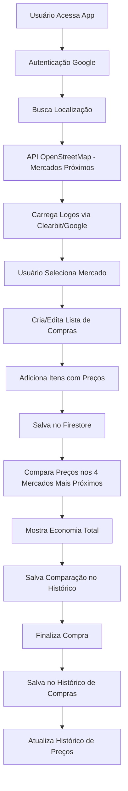

#  Economiza AI

**Economiza AI** é um aplicativo web moderno de lista de compras inteligente, desenvolvido em React com integração Firebase, focado em ajudar usuários a economizar através de comparação de preços, histórico de compras e gestão inteligente de mercados.

---

## 🎯 **Objetivo Real do Projeto**

O **Economiza AI** foi desenvolvido para transformar a experiência de compras em algo mais inteligente e econômico. O sistema permite:

- **Gestão de mercados próximos** com busca automática via OpenStreetMap
- **Listas de compras inteligentes** com persistência em Firebase
- **Histórico detalhado** de todas as compras realizadas
- **Sistema de preços** para comparação entre mercados
- **Comparação inteligente** dos 4 supermercados mais próximos
- **Interface responsiva** otimizada para mobile e desktop

---

## 🏗️ **Arquitetura Técnica Real**

### **Frontend**

- **React 18** - Framework principal com hooks modernos
- **CSS3** - Estilização com gradientes, glassmorphism e animações
- **Material-UI** - Componentes de interface (@mui/material, @mui/icons-material)
- **Fuse.js** - Busca fuzzy para sugestões inteligentes

### **Backend & Banco de Dados**

- **Firebase Firestore** - Banco de dados NoSQL em tempo real
- **Firebase Auth** - Autenticação com Google
- **Firebase Hosting** - Deploy e hospedagem

### **APIs Integradas**

- **OpenStreetMap Overpass API** - Busca de mercados próximos
- **Clearbit Logo API** - Logos automáticos de mercados
- **Google Images** - Fallback para logos (via proxy CORS)

### **Funcionalidades Avançadas**

- **Tesseract.js** - OCR para leitura de preços (em desenvolvimento)
- **ZXing Browser** - Leitor de código de barras (em desenvolvimento)
- **OpenAI API** - Sugestões inteligentes (configurado)

---

## 🔄 **Fluxo Real do Sistema**



---

## 📱 **Funcionalidades Implementadas**

### ✅ **Sistema de Mercados**

- **Busca automática** de mercados próximos via OpenStreetMap
- **Cálculo de distância** usando fórmula de Haversine
- **Logos automáticos** via Clearbit API + fallback Google Images
- **Mercados favoritos** com persistência no Firestore
- **Adição manual** de mercados personalizados
- **Agrupamento por distância** (até 1km, 1-2km, 2-5km, +5km)

### ✅ **Lista de Compras**

- **Interface intuitiva** com cards glassmorphism
- **Adição de itens** com nome, quantidade, valor unitário
- **Persistência automática** no Firestore
- **Sincronização** entre dispositivos
- **Barra de progresso** visual em tempo real

### ✅ **Sistema de Preços**

- **Registro de preços** por item/mercado
- **Histórico de preços** com timestamps
- **Comparação automática** com compras anteriores
- **Estrutura de dados** otimizada no Firestore

### ✅ **Histórico de Compras**

- **Visualização detalhada** de cada compra
- **Cálculo automático** de totais
- **Cards responsivos** com informações completas
- **Navegação intuitiva** entre histórico e detalhes

### ✅ **Autenticação & Usuários**

- **Login com Google** via Firebase Auth
- **Perfis de usuário** com dados persistentes
- **Sistema de permissões** (USER, STORE_MANAGER, ADMIN)
- **Gestão de usuários** para administradores

### ✅ **Interface & UX**

- **Design responsivo** para mobile, tablet e desktop
- **Modo escuro/claro** com persistência
- **Animações suaves** e transições
- **Acessibilidade** com navegação por teclado
- **Loading states** e feedback visual

### 🏪 **Comparação Inteligente de Preços** ⭐ **NOVA FUNCIONALIDADE**

### 🎯 **Objetivo da Funcionalidade**

O **Economiza AI** irá implementar um sistema inteligente de comparação de preços que analisa automaticamente os **4 supermercados mais próximos** da sua localização e calcula quanto você gastaria se comprasse sua lista completa em cada um deles, indicando qual oferece a **melhor economia total**.

### 📊 **Como Funcionará**

1. **Detecção Automática**: O app identifica os 4 supermercados mais próximos da sua localização
2. **Análise de Preços**: Para cada item da sua lista, busca o preço mais recente em cada mercado
3. **Cálculo Total**: Soma todos os preços para criar um total por mercado
4. **Comparação Visual**: Mostra uma tabela comparativa com economia potencial
5. **Recomendação**: Destaca o mercado que oferece a maior economia

### 💡 **Exemplo Prático**

**Sua Lista de Compras:**

- Arroz (5kg) - 2 unidades
- Feijão (1kg) - 3 pacotes
- Óleo de Soja (900ml) - 2 unidades
- Macarrão (500g) - 4 pacotes
- Leite (1L) - 6 caixas

**Comparação nos 4 Mercados Mais Próximos:**

| Item          | Supermercado A | Supermercado B | Supermercado C | Supermercado D |
| ------------- | -------------- | -------------- | -------------- | -------------- |
| Arroz (2x)    | R$ 18,00       | R$ 16,50       | R$ 19,20       | R$ 17,80       |
| Feijão (3x)   | R$ 15,00       | R$ 14,70       | R$ 16,50       | R$ 15,90       |
| Óleo (2x)     | R$ 12,00       | R$ 11,80       | R$ 13,20       | R$ 12,60       |
| Macarrão (4x) | R$ 8,00        | R$ 7,60        | R$ 8,80        | R$ 8,20        |
| Leite (6x)    | R$ 24,00       | R$ 23,40       | R$ 25,80       | R$ 24,60       |
| **TOTAL**     | **R$ 77,00**   | **R$ 74,00**   | **R$ 83,50**   | **R$ 79,10**   |

**🎯 Resultado:**

- **Melhor Opção**: Supermercado B - R$ 74,00
- **Economia**: R$ 9,50 em relação ao mais caro
- **Distância**: 1,2km da sua localização

### 🔧 **Implementação Técnica**

#### **Estrutura de Dados**

```javascript
// Comparação de preços por mercado
const priceComparison = {
  userLocation: { lat: -23.5505, lng: -46.6333 },
  nearbyStores: [
    {
      id: 'store_1',
      name: 'Supermercado A',
      distance: 0.8, // km
      totalPrice: 77.0,
      items: [
        { name: 'Arroz 5kg', quantity: 2, unitPrice: 9.0, total: 18.0 },
        // ... outros itens
      ],
    },
    // ... outros mercados
  ],
  bestOption: {
    storeId: 'store_2',
    totalSavings: 9.5,
    percentageSavings: 11.4,
  },
};
```

#### **Algoritmo de Comparação**

```javascript
// Função principal de comparação
const comparePrices = async (shoppingList, userLocation) => {
  // 1. Buscar 4 mercados mais próximos
  const nearbyStores = await getNearbyStores(userLocation, 4);

  // 2. Para cada mercado, calcular preço total da lista
  const comparisons = await Promise.all(
    nearbyStores.map(async store => {
      const totalPrice = await calculateTotalPrice(shoppingList, store.id);
      return {
        store,
        totalPrice,
        distance: calculateDistance(userLocation, store.coords),
      };
    })
  );

  // 3. Encontrar melhor opção
  const bestOption = comparisons.reduce((best, current) =>
    current.totalPrice < best.totalPrice ? current : best
  );

  // 4. Calcular economia
  const maxPrice = Math.max(...comparisons.map(c => c.totalPrice));
  const savings = maxPrice - bestOption.totalPrice;

  return { comparisons, bestOption, savings };
};
```

### 📱 **Interface do Usuário**

#### **Tela de Comparação**

- **Cards comparativos** para cada mercado
- **Destaque visual** para a melhor opção
- **Gráfico de barras** mostrando diferenças de preço
- **Botão de navegação** para o mercado escolhido
- **Histórico de comparações** salvo automaticamente

#### **Recursos Visuais**

- 🏆 **Badge "Melhor Preço"** no mercado vencedor
- 💰 **Indicador de economia** em reais e porcentagem
- 📍 **Distância** de cada mercado
- ⏰ **Última atualização** dos preços
- 🔄 **Atualizar preços** manualmente

#### **Histórico de Comparações** 📊

- **Salvamento automático** de todas as comparações realizadas
- **Análise temporal** de economia ao longo do tempo
- **Tendências de preços** por mercado e item
- **Relatórios de economia** mensal e anual
- **Comparação com compras anteriores** para acompanhar progresso

### 🚀 **Roadmap de Implementação**

#### **Fase 1 - Estrutura Base** ✅

- [x] Sistema de mercados próximos
- [x] Registro de preços por item
- [x] Estrutura de dados no Firestore

#### **Fase 2 - Comparação Básica** 🔄

- [ ] Algoritmo de cálculo de totais
- [ ] Interface de comparação
- [ ] Destaque da melhor opção

#### **Fase 3 - Recursos Avançados** 📋

- [ ] Histórico de comparações
- [ ] Alertas de variação de preço
- [ ] Integração com APIs de preços
- [ ] Sugestões de economia

#### **Fase 4 - Otimizações** 🎯

- [ ] Cache inteligente de preços
- [ ] Machine Learning para previsões
- [ ] Notificações de promoções
- [ ] Integração com cupons

### 💰 **Benefícios para o Usuário**

- **Economia Real**: Economize até 15-20% em suas compras
- **Tempo Poupança**: Não precisa visitar múltiplos mercados
- **Decisão Informada**: Dados precisos para escolher o melhor local
- **Histórico Inteligente**: Acompanhe variações de preço ao longo do tempo
- **Localização Otimizada**: Foque nos mercados realmente próximos
- **Acompanhamento Temporal**: Veja sua evolução de economia mês a mês
- **Relatórios Detalhados**: Análise completa de gastos e economias

---

## 🗄️ **Estrutura do Banco de Dados (Firestore)**

### **Coleções Principais**

```
/users/{userId}/
├── favorites/stores - Lojas favoritas
├── shoppingLists/{storeId} - Listas de compras
├── location - Localização do usuário
└── profile - Dados do perfil

/prices/{itemName}/stores/{storeName}/
├── latestPrice - Preço mais recente
└── history/ - Histórico de preços

/stores/{storeId}/
├── name, address, coords
├── logoUrl, website
└── managers - Gerentes da loja

/comparisons/{comparisonId}/ ⭐ NOVA COLEÇÃO
├── userId - ID do usuário
├── timestamp - Data/hora da comparação
├── userLocation - Localização do usuário
├── shoppingList - Lista de compras comparada
├── comparisons - Resultados por mercado
├── bestOption - Melhor opção encontrada
└── metadata - Metadados da comparação
```

---

## 🛠️ **Tecnologias Detalhadas**

| Tecnologia        | Versão  | Uso                    |
| ----------------- | ------- | ---------------------- |
| **React**         | 18.2.0  | Framework principal    |
| **Firebase**      | 11.9.1  | Backend completo       |
| **Material-UI**   | 5.15.10 | Componentes UI         |
| **Fuse.js**       | 7.0.0   | Busca fuzzy            |
| **Tesseract.js**  | 6.0.1   | OCR (dev)              |
| **ZXing Browser** | 0.1.5   | Código de barras (dev) |
| **OpenAI**        | 5.6.0   | Sugestões IA           |

---

## 🚀 **Como Executar o Projeto**

### **Pré-requisitos**

- Node.js >= 16.0.0
- npm >= 8.0.0
- Conta Firebase

### **Instalação**

```bash
# Clone o repositório
git clone https://github.com/leodigory/Economiza-ai.git
cd Economiza-ai

# Instale as dependências
npm install

# Configure as variáveis de ambiente
cp .env.example .env
# Edite .env com suas credenciais Firebase
```

### **Variáveis de Ambiente Necessárias**

```env
REACT_APP_FIREBASE_API_KEY=your_api_key
REACT_APP_FIREBASE_AUTH_DOMAIN=your_project.firebaseapp.com
REACT_APP_FIREBASE_PROJECT_ID=your_project_id
REACT_APP_FIREBASE_STORAGE_BUCKET=your_project.appspot.com
REACT_APP_FIREBASE_MESSAGING_SENDER_ID=your_sender_id
REACT_APP_FIREBASE_APP_ID=your_app_id
REACT_APP_OPENAI_API_KEY=your_openai_key
```

### **Execução**

```bash
# Desenvolvimento
npm start

# Build para produção
npm run build

# Testes
npm test
```

---

## 📊 **Funcionalidades em Desenvolvimento**

### 🔄 **OCR e Código de Barras**

- **Tesseract.js** configurado para leitura de preços
- **ZXing Browser** para leitura de códigos de barras
- **Integração** com APIs de produtos

### 🤖 **Sugestões Inteligentes**

- **OpenAI API** configurada
- **Sugestões baseadas** em histórico
- **Recomendações** de economia

### 🏪 **Comparação Inteligente de Preços** ⭐ **EM DESENVOLVIMENTO**

- **Algoritmo de comparação** dos 4 mercados mais próximos
- **Cálculo automático** de economia total
- **Interface comparativa** com cards visuais
- **Histórico de comparações** para análise temporal
- **Alertas de variação** de preços entre mercados

### 📱 **PWA Features**

- **Service Worker** configurado
- **Manifest** para instalação
- **Offline support** em desenvolvimento

---

## 🎨 **Design System**

### **Cores Principais**

- **Primária**: `#667eea` (Azul)
- **Secundária**: `#764ba2` (Roxo)
- **Sucesso**: `#4CAF50` (Verde)
- **Aviso**: `#FF9800` (Laranja)

### **Componentes**

- **Glassmorphism** - Cards com efeito vidro
- **Gradientes** - Transições suaves
- **Animações** - Micro-interações
- **Responsividade** - Mobile-first

---

## 🔒 **Segurança**

- **Firestore Rules** configuradas
- **Autenticação** obrigatória
- **Validação** de dados
- **Rate limiting** nas APIs

---

## 📈 **Métricas e Performance**

- **Lighthouse Score**: 90+ (Performance, Accessibility, Best Practices)
- **Bundle Size**: Otimizado com code splitting
- **Loading Time**: < 2s em conexões 3G
- **PWA Ready**: Service worker ativo

---

## 🤝 **Contribuição**

1. **Fork** o projeto
2. **Crie** uma branch para sua feature
3. **Commit** suas mudanças
4. **Push** para a branch
5. **Abra** um Pull Request

### **Padrões de Código**

- **ESLint** configurado
- **Prettier** para formatação
- **Conventional Commits**
- **TypeScript** (em migração)

---

## 📄 **Licença**

Este projeto está sob a licença **MIT**. Veja o arquivo `LICENSE` para mais detalhes.

---

## 🙏 **Agradecimentos**

- **Firebase Team** pela infraestrutura robusta
- **OpenStreetMap** pelos dados de mercados
- **Material-UI** pelos componentes
- **Comunidade React** pelo ecossistema

---

> **Economiza AI** — Transformando compras em economia inteligente! 💰

_Desenvolvido com ❤️ por Leonardo Araujo_
